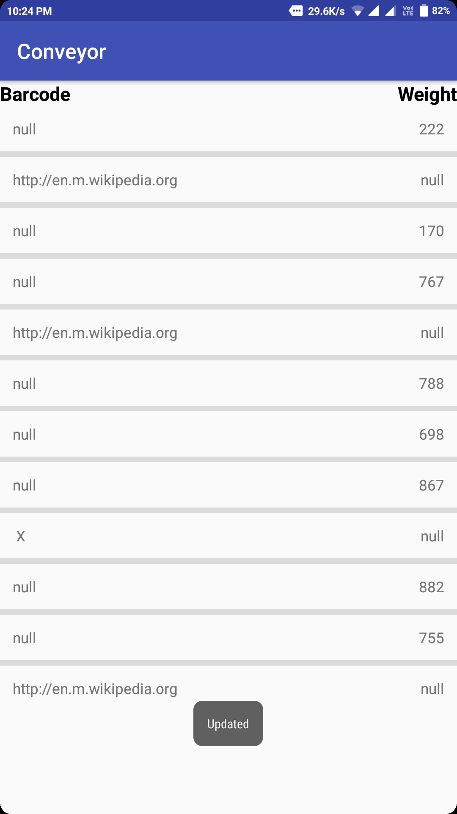

# Conveyor

This app fetches data from an API which stores the barcode and weight of an object passing through
a sensor on the conveyor. 
The object can be identified from the barcode with corresponding weight and the data is updated every 5 seconds
from the API.

ScreenShot
----------

